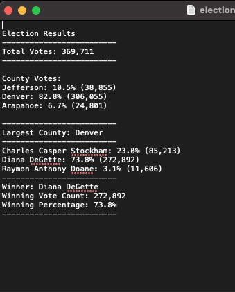
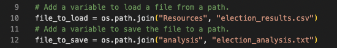
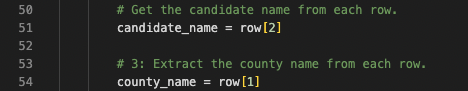
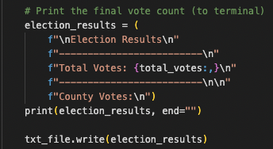

# Election_Analysis

## Overview of Election Audit

The purpose of our election audit analysis was to help the election commission with some summary data in addition to the more detailed information they already had. Voter turnout, the most active county, and county vote percentages were also needed by the commission in order to complete the audit. We provided such data in the form of a txt file that is output from running our code in order to increase usability.

 

## Election Audit Results

The election audit concluded that the highest voter turnout came from Denver county, and that Diane Degette had the most votes at 73.8% of the total vote. The data was as follows: 

- Total Votes: 369,711

- County Votes:
  Jefferson: 10.5% (38,855)
  Denver: 82.8% (306,055)
  Arapahoe: 6.7% (24,801)

- Largest County: Denver

- Charles Casper Stockham: 23.0% (85,213)
  Diana DeGette: 73.8% (272,892)
  Raymon Anthony Doane: 3.1% (11,606)

- Winner: Diana DeGette
  Winning Vote Count: 272,892
  Winning Percentage: 73.8%

## Election-Audit Summary

The code used for this has been thoroughly commented in order to allow for it to be used for future audits with minimal work/technical knowledge. Some examples of which are the following:

 
	This code allows you to pull data from a specified source and output results to a specific source. These file paths can be changed based on your use case.

 
	This code controls the variables that parse specific columns/rows in the linked csv file. This can be changed based on your knowledge of the columns and rows of data in your source file

 
	Lastly, these lines of code print specifically formatted results from out data calculations. You can change the output to be formatted to suit your needs 
